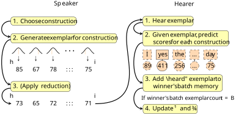

## Introduction {#sec-introduction}

One of the prime usage-based mechanisms of language change is the reducing effect [@bybee_usage_2006]. The reducing effect states that high-frequency constructions tend to be more phonetically reduced than low-frequency constructions, the result of so-called "neuromotor automation" [@bybee_frequency_2007]: as speakers continually repeat a construction, the articulatory gestures of that construction become more and more condensed. Since high-frequency constructions are used more, this automation process has a higher opportunity of occurring than in low-frequency constructions.

The neuromotor automation process manifests itself in two ways: temporal reduction and substantive reduction [@mowrey_articulatory_1987]. Temporal reduction entails the compression of several articulatory gestures[^gesture] into one (i.e. assimilation or cluster simplification), while substantive reduction entails the reduction in magnitude of an articulatory gesture (i.e. vowel reduction to schwa). The combined effect of these two processes is then known under the more general term "reduction". We assume both these effects when we further use the term "reduction".

[^gesture]: An articulatory gesture can be defined as a movement of an articulator with an observable effect [@browman_articulatory_2009].

### Empirical traces of reduction

The existence of the reducing effect has been demonstrated through several studies. One of the earliest examples is @fidelholtz_word_1975, who shows that frequency can be related to vowel reduction in several phonetic contexts in English. Another example is @pluymaekers_lexical_2005: they tested the reduction of affixes in Dutch and found that reduction was positively related to the frequency of the carrier word. Finally, @bybee_effect_1999 discuss how English *don't* is most likely to be reduced in constructions where *don't* is highly frequent (like *I don't know*). These three studies respectively show that reduction can apply to words, bound morphemes and whole phrases.

In addition, several other synchronic factors have been found to influence the rate of reduction. In her overview of reduction, @ernestus_acoustic_2014 mentions the phenomenon to be influenced by phonological context (e.g. assimilation to ease the overlap of articulatory gestures), speech rate (reducing the number of gestures to be able to speak faster) and predictability [reducing the number of gestures because they are predictable from the context, independent from frequency, @bell_predictability_2009]. While we agree that these factors are also important in "on-line" reduction, in this study, we focus frequency of reduction in a wider diachronic context.

### Context against ambiguity and the role of frequency {#sec-introduction-frequency}

One important question in reduction theory is how hearers deal with the ambiguity that naturally comes with reduced speech. As constructions reduce, they take up increasingly sparse phonetic representations, which can hinder recognition. Usually, however, hearers make use of rich contextual clues to recover the intended mapping. @mattys_speech_2012 [959-960] argue that contextual support is thus much more important in challenging conditions, like for example reduced speech: as the acoustic signal becomes harder to parse, hearers will have to rely more on their knowledge about language to corrently interpret what the speaker intended.

One example of contextual knowledge is frequency. Many "units" in language (constructions, sounds ...) are distributed according to Zipf's Law [@zipf_psycho-biology_1965], a power law in which rank is inversely related to frequency. This means that the first item in a Zipfian distribution is twice as frequent as the second item, three times as frequent as the third item, and so on. In practice, this leads to an extremely unbalanced distribution with few highly frequent items, and a long tail of infrequent items. This uneven distribution is also called an "A-curve" by @kretzschmar_language_2015.

In theory, hearers should thus be able to rely on this skewed frequency information when choosing an interpretation in ambiguous circumstances. Of course, there are many more contextual clues than frequency alone, but frequency can be regarded as one of the most constant contextual factors; unlike other contextual factors, frequency is inherent to language [which is apparent in processes like entrenchment, @langacker_foundations_1987, 59; also grammaticalisation, @hopper_grammaticalization_2003]. Additionally, frequency is regarded as a strong influential factor in decision making in general [@hasher_automatic_1984].

While we know that contextual factors can aid recognition, it is difficult to assess to what extent. In addition, it is unclear whether frequency alone is enough to avoid ambiguity-related communication difficulties. Since frequency sensitivity is an automatic direct and indirect process in humans [@jonides_estimating_1987] and therefore cannot be easily sidestepped, we turn to computer simulations. Computer simulations allow one to virtualise reality into a model in which virtual language users ("agents") communicate with each other on the basis of simple, local rules [@steels_modeling_2011; @dekker_conversational_2024]. The idea is that the interplay of their interactions leads to emergent linguistic behaviour, which in our case is the reducing effect. Our goal in this article is to investigate which specification of assumptions is needed for the language in our computer model to exhibit the reducing effect, displaying the same properties as those found in corpus data, without communicative confusion among agents. Because we work with computer simulations, we can assume several outlooks on reality and the reducing effect, and try several assumptions in order to find the minimal requirements needed for the reducing effect to occur. We start with the minimal assumptions inferred from the literature, and will build upon these if it proves needed. Such outcomes can be theoretically interesting, since they make the various aspects of reducing effect theory more explicit, and since they can function as a stepping stone for further experimental or empirical research. While the real world is far messier and noisier than the idealised world represented in our simulations, simulation results can nevertheless "suggest that such underlying principles may operate in the real world as well" [@stanford_revisiting_2013, 122].

## Model design

In this section, we will first discuss the core architecture of the simulation. This is the part of the simulation that will remain invariant across parameter permutations. Our core architecture is based on empirical research in the usage-based linguistics paradigm [as recommended by @loreto_theoretical_2010, 69]. Usage-based linguistics views language as a complex adaptive system, i.e. a system shaped through repeated use by language users [@beckner_language_2009]. This makes it a natural fit for our agent-based simulations, which operate on the same principle. After we have introduced all core mechanisms in our simulation, we will discuss the variable parts of our model and the initial specification we chose. We implemented our model of the reducing effect in Python using the MESA library [@python-mesa-2020]. All source code is available online.[^github-link]

[^github-link]: https://github.com/AntheSevenants/fwo-frequency-reduction

### Formalisation of speech {#sec-speech-formalisation}

For our reducing effect simulation, we made the decision to model speech using vector representations. Such vector representations are popular in the field of machine learning, both to represent meaning [@mikolov_efficient_2013] and acoustic information [@baevski_wav2vec_2020]. Our vector representations are formalised abstractions of an acoustic signal and are comparable to the sequences of "frames" found in speech recognition applications, i.e. short snapshots of the acoustic spectrum that are transformed to account for human hearing ["Mel scale", @pedersen_mel_1965]. To keep our architecture as straightforward as possible, we use a single vector representations to represent the acoustic features associated with a construction.

Our vector representations are constrained in several ways that are unlike representations of, for example, meaning. Firstly, the values in our vectors can only be positive. This constraint stems from the acoustic nature of our representations: we intend our vectors to encode the presence of acoustic energy, and "negative presence" does not apply in this context. The minimum theoretical value in any of our vectors is, therefore, zero (no energy). Semantic vectors, by comparison, can have negative values, since there is no straightforward explanation of what the axes in a semantic vector actually represent. As such, they are not bound to similar constraints. In addition, we chose to cap the maximum value in our acoustic vectors at 100. Other maximum values at other scales are possible, but we chose this value specifically because it is easy to interpret.

Our representations are also similar to semantic vectors in several ways. Just like semantic vectors, our acoustic vectors are distributed representations, i.e. representations consisting of multiple dimensions, while other models of sound change often use atomic values to represent sounds across just one axis [e.g. @stanford_revisiting_2013; @todd_word_2019]. Constructions are thus represented by unique combinations of numbers across several dimensions, rather than just a single numbers. Though there is no intrinsic sequentiality to the dimensions in the vectors, they do determine vector identity itself: $\begin{bmatrix} 58 & 96 & 34 \end{bmatrix}$ is a different vector from $\begin{bmatrix} 34 & 96 & 58 \end{bmatrix}$, even though they have the same total energy. This would not be possible using a single number. It is clear that the acoustic identity of a construction becomes much simpler once the contrasts between different dimensions disappear: $\begin{bmatrix} 50 & 50 & 50 \end{bmatrix}$ is a much less complex representation than $\begin{bmatrix} 58 & 96 & 34 \end{bmatrix}$. When two vectors have similar values across the same dimensions, they are assumed to sound similar to one another. 

Using vector representations over characters representations to represent the acoustic forms associated with constructions is worthwile given the fact that reduction can also happen on a tonal level, e.g. in Mandarin [@kong_frequency_2019]. Such distinctions can be assumed to be encoded across our distributed representations, along with other sub-phonemic information that would be hard to encode using characters alone. 

For the basis of our vectors, we made the deliberate decision not to use any data from actual natural languages, since we wanted our model to be maximally language agnostic. Instead, we opted to use randomly generated speech representations, generating a matrix of $V \times D$, with $V$ being the number of constructions[^ctx] in the vocabulary of the agents and $D$ being the number of dimensions. The values of the vectors are randomly generated natural numbers between 70 and 100. The vectors are generated in such a way that, at the starting point of the simulations, their mutual distances apart are as similar as possible. Of course, once the vectors start reducing, this will change. An example of the vector representations for the constructions in our model is given in @tbl-model_design_speech_vector_examples. The exact algorithm used to generate the vectors is clarified in @sec-appendix-todo, along with our reasoning for generating only values between a specific interval.

[^ctx]: By 'constructions', we mean pairings of meaning and forms learnt by language users [@goldberg_constructions_2006, 6], as these can be thought of as the most general units within usage-based linguistics that are eligible for undergoing reduction. 

|  Construction  | Dim 1 | Dim 2 | Dim 3 | ... | Dim $D$ |
| -------------- | ----- | ----- | ----- | ----- | ----- |
| Construction 1 | 71    | 89    | 85    | ...   | 83    |
| Construction 2 | 87    | 72    | 70    | ...   | 98    |
| ... | | | | |
| Construction $V$ | 88    | 76    | 91    | ...   | 88    |

: Example base vector representations for the constructions in the simulation model. These are the "original" vector representations that will have noise added to them once the agents' memories are initialised. {#tbl-model_design_speech_vector_examples}

Note also that, since we are interested in the reduction of the form of constructions, the meaning of constructions is not explicitly modelled in our simulations. Instead, we implicitly assume that all meanings remain constant across different exemplars of the same constructions, even if the form becomes strongly reduced. This drive towards simplicity is in accordance with best practices in agent-based modelling [@landsbergen_cultural_2009; @beuls_agent-based_2013; @pijpops_lectal_2022].

### Agent memory {#sec-agent-memory}

The agents in our model do not store encountered realisations in memory *as-is*. Rather, we model [exemplar theory @bybee_usage_2006] through a series of normal distributions, inspired by the Bayesian robust speech perception model by @kleinschmidt_robust_2015. Each agent stores for each construction and each vector dimension a normal distribution, encoded as parameters $\mu$ and $\sigma$[^population]. The variation that these distributions allow for can encode, for example, the different realisations of *yes*: *yeah*, *yep*, *yup*, *ye* ... At the model initialisation stage, we take the vector representations generated for each construction and use those values as the initial values for $\mu$. $\sigma$ is initialised at value 5 for each dimension in each vector representation.

[^population]: Despite our use of $\mu$ and $\sigma$, it is difficult to speak of "population-level" parameters here. Still, we use this notation to align with the notation found in @kleinschmidt_robust_2015.

### Language game and course of the simulation {#sec-language-game}

In this section, we will explain the interactional behaviour of our virtual speakers and hearers in more detail.

At each step in the simulation, each agent in the simulation enters into a "conversation" at random with another randomly selected agent. The agent initiating the conversation functions as the speaker, the other agent functions as the hearer. In this conversation, speaker and hearer play a so-called "language game" [@smith_models_2014], the core of our simulation. The goal of the language game is for the speaker to communicate a specific construction to the hearer, which the hearer then has to understand successfully. An overview of the game can be found in @fig-model_design_language_game. The language game goes as follows:

**Speaker**

1. The speaker is assigned a construction to utter from the $V$ constructions available. The probability of each construction being assigned is determined by the Zipfian distribution (see @sec-underspecification-filling).[^zipfian-note] For our implementation of Zipf's Law, we chose the standard Zipfian equation (shown in @eq-zipfian_distribution). While other iterations of the Zipfian equation, devised to improve alignment with empirical data, exist [i.e. the Zipf-Mandelbrot equation, @mandelbrot_information_1966], these improved alignments are not perfect either [@montemurro_beyond_2001]. Most notably for our use case, the more involved Zipfian distribution equations require more parameters, which makes our search for the smallest set of assumptions conducive to the reducing effect more difficult. The only parameter in the original Zipfian equation is $\beta$, which we set to 1.
$$
\operatorname{freq}(x) = \frac{1}{x^\beta}
$$ {#eq-zipfian_distribution}
2. The speaker generates an exemplar vector representation $v$ to utter for that construction by iteratively sampling from the normal distributions saved for each dimension of that construction:
  $$
  \begin{align}
    &\text{For a construction } c: \\
    \\
    &\mathbf{v_c} = \begin{bmatrix} 
    v_{c, 1} \\ v_{c, 2} \\ \vdots \\ v_{c, D}
    \end{bmatrix}, \quad 
    \text{where } v_{c,j} \sim \mathcal{N}(\mu_{c,j}, \sigma_{c,j}) \text{ for } j = 1, \dots, D
  \end{align}
  $$
  Values centred around $\mu$ are more likely to be sampled. 
3. With a probability of $p$, reduction is applied. We assume that, when possible, hearers will attempt to conserve as much energy as possible when speaking on grounds of the "Principle of Least Effort" [@zipf_human_1949]. In order to model both temporal and substantive reduction, we apply two operations. For temporal reduction, we pull all values in the vector towards each other. This is done by adding a small proportion of the difference with the mean to the vector. This operation is comparable to the compression of articulatory gestures in the reduction process, and, in a similar vein, weakens the acoustic identity of the representation. The compression operation is regulated by a homogenisation factor $\eta$. For substantive reduction, we multiply all vector values by a fixed decay parameter $\lambda$, comparable to the reduction in magnitude of articulatory gestures. If the mean of all values in a vector falls below floor value $R$, no reduction takes place. Without the floor value $R$, the normal distribution would be able to underflow below zero, which goes against our vector constraints (see @sec-appendix-vector):
  $$
  \begin{align}
    \mathbf{v}^{reduced} = \lambda \left( \mathbf{v} + \eta \left( \bar{v} - \mathbf{v} \right) \right)
  \end{align}
  $$
4. All vector values are rounded to the nearest integer (see @sec-perception-todo).
5. The (potentially reduced) vector is communicated to the hearer.

**Hearer**

1. The hearer "hears" the vector communicated by the speaker.
2. The hearer interprets the vector representation of the speaker. Classification works in a generative way, as in @kleinschmidt_robust_2015 [151]. The hearer checks how likely the communicated vector is given their knowledge about the acoustic realisations of the different constructions. For each construction, for each dimension, the likelihood of the heard vector's value is computed. Crucially, if enabled, the prior likelihood of the construction is taken into account as well, i.e. the contextual linguistic knowledge from @sec-introduction-frequency. All values are log-transformed to make computations faster. The construction with the highest score is accepted as the understood construction:
  $$
  \begin{align}
    \operatorname{Score}(\mathbf{v}^{\text{heard}} \mid c) &= 
    \begin{cases} 
      \ln(p(c)) + \sum_{j=1}^{D} \ln \left( \mathcal{N}(\mathbf{v}^{\text{heard}}_{j} \mid \mu_{c_{j}}, \sigma_{c_{j}}) \right) & \text{if priors enabled} \\
      \sum_{j=1}^{D} \ln \left( \mathcal{N}(\mathbf{v}^{\text{heard}}_{j} \mid \mu_{c_{j}}, \sigma_{c_{j}}) \right) & \text{otherwise}
    \end{cases} \\
    \hat{c} &= \arg\max_{c \in C} \left[ \operatorname{Score}(\mathbf{v}^{\text{heard}} \mid c )\right]
  \end{align}
  $$
3. Parameters $\mu$ and $\sigma$ are updated for the heard construction according to an Exponential Moving Average formula, modified for batches. We use a batch memory instead of updating $\mu$ and $\sigma$ immediately in order to ensure the parameters remain stable.[^outlier-infuence] The heard vector is saved in a batch memory of size $B$. Once that batch memory has $B$ exemplars, the mean and variance of the batch memory are computed, and $\mu$ and $\sigma$ are updated according to a weighted average. $\alpha$ regulates the learning rate. The final result is rounded to the nearest integer. $\sigma$ has a minimum value of 1:
  $$
  \begin{align}
    &\mathbf{X}_c = \{\mathbf{x}_1, \mathbf{x}_2, \dots, \mathbf{x}_B\} = \text{ batch memory for construction } C \\
    \\
    &\text{For each dimension } j \in \{1, \dots, D\}: \\
    &\hspace{1cm} \mathbf{\mu}^{\text{batch}}_{c,j} = \frac{1}{B} \sum_{i=1}^{B} \mathbf{x}_{c,i,j} \quad , 
    \quad \mathbf{\sigma}^{\text{batch}}_{c,j} = \sqrt{\frac{1}{B-1} \sum_{i=1}^{B} (\mathbf{x}_{c,i,j} - \mathbf{\mu}^{\text{batch}}_{c,j})^2} \\
    &\hspace{1cm} \mu_{c,j}^{\text{new}} = \text{round}\left( (1 - \alpha) \cdot \mu_{c,j}^{\text{old}} + \alpha \cdot \mu^{\text{batch}}_{c,j} \right) \\
    &\hspace{1cm} \sigma_{c,j}^{\text{new}} = \max\left( 1, \,\, (1 - \alpha) \cdot \sigma_{c,j}^{\text{old}} + \alpha \cdot \sigma^{\text{batch}}_{c,j} \right)
  \end{align}
  $$
  After the update, the batch memory is emptied.

[^zipfian-note]: Note that we do not explicitly model a world or ground. The extralinguistic world is assumed through the Zipfian distribution. For our model, the addition of an outside world with events would not have any added value, which is why we implemented events about the world in this way.

[^outlier-infuence]: More specifically, by using batch memory, we prevent one-off outlier values from affecting $\mu$ and $\sigma$ directly. Cognitively, using batch memory can be seen as hearers updating their internal representations gradually, instead of shifting them dramatically when a new, perhaps strange form is encountered.

{#fig-model_design_language_game}

Note that we deliberately left out any feedback mechanism from the language game, as we are looking for the absolute minimal specification that is conducive to the reducing effect. Since including feedback implies adding an extra assumption, our initial aim is to attempt to model the reducing effect without a feedback mechanism. In addition, nowhere in our language game is there a built-in assumption which dictates that frequent constructions should reduce faster and to a larger extent than less frequent constructions. Rather, this is the emergent behaviour that needs to occur naturally out of the agents' interactions.

## Evaluation

In this section, we will explain how we will analyse the simulation behaviour, and how we will evaluate the model as a whole, particularly how we test whether a simulation model leads the reducing effect as defined by @bybee_usage_2006.

### Expected behaviour {#sec-expected-behaviour}

We will consider a set of preconditions to be conducive to the reducing effect if the following is true:



If the behaviour of a simulation corresponds with any of these three statements not being true, then we will say that that simulation does not produce behaviour sufficiently similar to the behaviour found in corpus studies. The assumptions of that simulation are then said not to be conducive to the reducing effect. 

If any specification of assumptions produces behaviour which fully falls within the expected behaviour detailed in the previous section, then we can say that that specification is conducive to the reducing effect. The next question is whether this set is the *minimal* specification required to produce the reducing effect. To check this, we apply the principle of Occam's Razor [@blythe_s-curves_2012]. This principle dictates that the simplest explanation for a phenomenon is presumably the most likely one. We apply this principle by adding assumptions incrementally. We start by drawing the assumed minimal assumptions from the literature, and will build upon these if it proves needed. In this way, we build towards the minimum viable set of assumptions.

### Parameters {#sec-parameters}

In this section, we will run through the different parameters the model has and what values we chose for them. Parameters control specific aspects of our model, like how many agents inhabit our virtual world or how likely reduction is. An important limitation to our parameter settings is computational tractability. Because we work with vector representations, and interpretation hinges on vector computations on an agent's entire exemplar memory, large agent counts, high dimension counts and large constructions counts all cause the time it takes to run a single simulation to balloon, even on powerful server hardware. Therefore, we had to keep number of agents and constructions modest. This is standard practice in agent-based simulation [cf. @dale_understanding_2012, 5]. Review @tbl-parameters for an overview of our choices. Our parameter value choices for the vectors in our model are explained in @sec-appendix-vector.

| Parameter | Explanation | Value |
| --- | --- | --- |
| $N$ | Number of agents | 10 |
| $V$ | Number of constructions | 100 |
| $D$ | Number of vector dimensions | 10 |
| $P$ | Number of constructions from which we sample | 50,000 |
| $v_{\min}, v_{\max}$ | The inclusive value range in between which vector values are initialised | 70, 100 |
| $R$ | Threshold floor value. If the mean of all values in a vector falls below this floor value, no reduction takes place. | 5 |
| $\eta$ | Homogenisation factor during reduction | 0.1 |
| $\lambda$ | Decay factor during reduction | 0.95 |
| $B$ | Number of exemplars held in batch memory | 20 |
| $p$ | Reduction probability at speech time | 0.5 |
: An overview of all parameters in the simulation and their values. {#tbl-parameters}

In the following sections, we will present the results of several different parameter combinations ("specifications") of our reducing effect model. Because our model is partially probabilistic, each specification is run 100 times. Any graph shown is an aggregate of the behaviour of those 100 runs. We make this aggregate by taking the median across all runs of a specification. We take the median specifically to prevent outlier results from influencing the results.

## Results

In this section, we will go over the results produced by the model operationalised according to the requirements detailed in the previous sections. More specifically, we will check if the model behaviour adheres to the expected behaviour defined in @sec-expected-behaviour.

### Testing the importance of frequency priors {#sec-priors-no-priors-model}

In this first section, we test whether the inclusion of category priors suffices to combat the expected ambiguity during the reduction of acoustic representations. We saw in @sec-introduction-frequency that, when challenging conditions arise, linguistic knowledge is said to become important during parsing by the hearer. We will test this by comparing the results of two types of models: in one model, we add the prior of the construction to the predicted score for each construction, in the other, we do not (see @sec-language-game). We then compare their respective behaviour of the simulation according to the rules defined in @sec-expected-behaviour. The formulas at the basis of all visualisations can be found in the Appendix (@sec-appendix-metrics).

TODO AANVULLEN

With respect to (1), @fig-base-model-l1-per-construction shows the average L1 of each construction separately. Recall that we expect frequent constructions to reduce a great extent, and faster as well. We indeed see that, generally speaking, frequent constructions (at the left of the graph) have lower L1 values than less frequent constructions (at the right of the graph).

As for (2), we can see in @fig-base-model-l1-general that the average L1, i.e. the average energy in the acoustic representations of constructions (see @sec-speech-formalisation) in the memory of the agents drops sharply. Therefore, we can say that, indeed, the system seems to have reorganised itself to be more efficient. Of course, given the non-zero probability of reduction (see @tbl-parameters), this is to be expected.

In @fig-base-model-half-life-per-construction, the "half life" period for each construction is given. We show how many iterations in the simulation it took for every acoustic representation to reach half of its original energy. We see that for more frequent constructions (at the left of the graph), this half time tends to be reached faster than for less frequent constructions (at the right of the graph). Most constructions, viz. those in the Zipfian tail, do not even show up in the graph, since they have not reached half their original energy yet.

Regarding (3), we refer to @fig-base-model-success. It shows both the micro-averaged and macro-averaged communicative success in the model. The micro-average refers to the total number of successes, and is influenced by Zipfian sampling. Because most of the speaking turns will concern the most frequent construction, the communicative success of that specific construction weighs significantly on the global, unadjusted success rate. The macro-average is an average across averages: each construction contributes equally towards the average, and therefore overrules Zipfian sampling. While the micro-average indicates communicative success in language use, the macro-average gives a better of idea of communicative success in the language system.

We see in @fig-base-model-success that overall, communicative success in the model remains above chance level, although it does decrease. As we mentioned, it is expected that there is some trade-off between sparsity and communicative success, and the model results arguably remain within this margin. However, the confusion matrix in @fig-base-model-matrix paints a different picture: for the top 35 most frequent constructions, there is a large discrepancy between what the speaker intended (y axis) and what the hearer heard (x axis).[^top-35] More specifically, several frequent constructions seem to become confused with the most frequent construction. If we take English words as an illustration, this behaviour is comparable to speakers saying words like "have", "you", or "but", with hearers always hearing the most frequent English word "the". This is a major flaw in the communication system of the agents, and it also does not correspond with realistic linguistic behaviour: reduction in real life does not lead to mass confusion. 

[^top-35]: Given the Zipfian distribution, the most frequent constructions have considerably more opportunity to reduce, and thus also more opportunity to take on representations that lead to communicative confusion. We focus on the top 35 most frequent constructions since they make out the bulk of communication, and because they are more prone to confusion. Note that less frequent constructions would also eventually erode to the point of confusion, it would just take more time in the simulation.

@fig-base-model-confusion-ratio shows the "correct interpretation ratio" for the ten most frequent constructions. The ratio expresses from 0 to 1 what share of exemplars, across agents, comes from successful interactions between agents. If an agent mistakes a heard form for a form that actually stands for another construction, the exemplar collection for the correct construction becomes diluted: another form is now also (wrongly) associated with that construction. If the exemplar collection for a specific construction contains a lot of mishearings, its correct interpretation ratio goes down. Here specifically, we see that the most frequent construction has a lower correct interpretation ratio than the other constructions. This means that the exemplars associated with the most frequent construction often stem from mishearings, which makes the exemplar cloud of that construction very broad and unstable. This makes sense, given how often the most frequent construction is confused with other constructions. The issue, however, is that we cannot know from these metrics exactly *how* the confusion arises and why the most frequent construction specifically becomes the target of the confusion. To find out the cause of confusion, we built another model, which we will discuss in the next section.

::: {#fig-base-model-group layout-ncol=2}

{#fig-base-model-l1-general}

{#fig-base-model-l1-per-construction}

{#fig-base-model-half-life-per-construction}

{#fig-base-model-success}

{#fig-base-model-matrix}

{#fig-base-model-confusion-ratio}

An overview of the different simulation behaviour metrics and their evolutions for the base model.
:::

### Funnel model {#sec-cone-model}

The main reason why we cannot reliably investigate the cause of confusion in the base model stems from the high dimensionality of the vectors. Because we work in a 10-dimensional space, there is no straightforward way to see how the vectors evolve over time. Unfortunately, dimensionality reduction techniques obscure a large share of the variation in the vectors, and are therefore unreliable to estimate the actual course of the acoustic representations.

The solution seems simple: reducing the number of dimensions to just two, which allows you to plot the acoustic representations accurately and reliably. This is indeed the solution we opted for, but with a few adjustments. We chose to represent the acoustic space as a funnel, because this brings the properties of a two-dimensional space closer to the behaviour of the multi-dimensional space: all representations have a straight path to the apex (there is no need to go "through" another representation), and the phonetic space becomes more sparse as one nears the apex. Other adjustments are mechanical adaptations to the funnel shape: all exemplars now reduce by moving at a straight angle towards the apex, and all constructions start at an equal radius of 100 from the apex. We limit ourselves to just ten constructions for this demonstration.[^frequency-truncation]

[^frequency-truncation]: For the frequency distribution of these ten items, we use the first ten frequencies from the larger, 100-construction Zipfian distribution found in the base model.

@fig-cone-model-group shows the vector space both at the beginning of the simulation and after 700 iterations. @fig-cone-model-angle-vocabulary-plot-2d-begin shows that, at the start of the simulation, the exemplars of different constructions are well spaced out. However, as the acoustic representations become sparser (i.e. move closer towards point 0,0), the space *between* representations also becomes smaller. This has the side-effect that the proximity of the exemplars of more frequent constructions will start to disturb the interpretation process described in @sec-language-game. Because our interpretation system hinges on frequency, the presence of a more frequent construction in the neighbourhood will skew this system, with the more frequent exemplars dominating perception. Mishearings of the associated constructions are the consequence. As the acoustic space becomes sparser and exemplars move even closer towards each other, more frequent constructions will iteratively start to overtake less frequent constructions until the most frequent form dominates the entire acoustic space. We see this in @fig-cone-model-angle-vocabulary-plot-2d-end: where the second and third most frequent constructions (green and blue respectively) first outnumber other constructions in their proximity, they become outnumbered once their interpretation neighbourhood becomes influenced by the most frequent construction (red).

The reason why we do not see this iterative process reflected in the base model is again the high dimensionality of the vectors. In the funnel model, there are only two dimensions in which constructions can inch closer together. In the higher dimensional model, the most frequent construction can be the closest neighbours of multiple constructions at once. The mechanics behind the confusion, however, are the same. A possible solution for these mishearings is given in the next section.

::: {#fig-cone-model-group layout-ncol=2}
![A flattened representation of the exemplar locations of a random agent in the funnel model (starting situation, 0 iterations). The x and y axes show the values of each representation directly. Each colour stands for a construction, with each triangle being an exemplar of a construction. All ten constructions are shown. The closer an exemplar is situated to the lower left corner, the more reduced it is. The interpretation neighbourhood is shown as a circle on a randomly selected exemplar and shows the range in which exemplars influence the classification of an exemplar at this location.](figures/fig-cone-model-angle-vocabulary-plot-2d-begin.png){#fig-cone-model-angle-vocabulary-plot-2d-begin}

![A flattened representation of the exemplar locations of a random agent in the funnel model (700 iterations). The x and y axes show the values of each representation directly. Each colour stands for a construction, with each triangle being an exemplar of a construction. All ten constructions are shown. The closer an exemplar is situated to the lower left corner, the more reduced it is. The interpretation neighbourhood is shown as a circle on a randomly selected exemplar and shows the range in which exemplars influence the classification of an exemplar at this location.](figures/fig-cone-model-angle-vocabulary-plot-2d-end.png){#fig-cone-model-angle-vocabulary-plot-2d-end}

An overview of the exemplar vector locations and their evolutions for the funnel model.
:::

### Re-entrance model {#sec-reentrance-model}

Now that we can see the mishearings happen in real time, the question arises how they can be avoided. A complicating factor is that we intentionally did not incorporate a feedback mechanism in our simulation: hearers cannot know that they are mistaking a construction for another, so they cannot say "come again?". Vice versa, a speaker cannot know whether a reduced form will cause a mishearing on behalf of the hearer, as they do not have access to the acoustic representations of the latter. As such, our model design without any feedback mechanism seems to lead to a linguistic catch 22.

Nevertheless, a solution within this design is possible on behalf of the speaker. Since speech production is a complex process, self-monitoring is an important part of speech production models [@hartsuiker_error_2001]. Psycholinguistic experiments such as @ferreira_how_2005 show empirical evidence for "comprehension monitoring", indicating that speakers can monitor their articulatory loop and preemptively avoid errors and ambiguities. It is in this light that @steels_language_2003 has coined the term "re-entrance". Re-entrance can be understood as the application of a speaker's reception subsystem to their own linguistic utterances, to serve as a means of incomprehension prevention or repair. Re-entrance is mechanically straightforward: a speaker's intended production is routed through their own reception mechanism, and its adequacy is subsequently assessed. It is in exactly this way that we have implemented this mechanism in our simulation. If a speaker reduces an acoustic representation, we first let them reflect on whether they would understand the uttered form correctly themselves. If they would, communication can continue as planned. If they would not, reduction is reversed, and the unreduced form is communicated.

{#fig-model_design_language_game_reentrance}

With this new precondition added to our basic assumptions, the model now behaves as expected. @fig-reentrance-model-l1-general shows an increase in sparsity, @fig-reentrance-model-l1-per-construction and @fig-reentrance-model-half-life-per-construction show reduction extent and speed to be influenced by frequency, @fig-reentrance-model-success shows adequate communicative success and @fig-reentrance-model-matrix and @fig-reentrance-model-confusion-ratio show little to no confusion.[^remaining-confusion] Therefore, it seems that an ambiguity avoidance mechanism is indeed required to obtain simulation results comparable with corpus data, leading to the following specification:

1. Zipfian frequency difference between constructions
2. No association between frequency and the speaker's inclination to reduce
3. Re-entrance as an ambiguity avoidance mechanism

[^remaining-confusion]: We manually inspected individual model runs to check what situations still cause communication to fail. We found that most confusion occurs between constructions with similar frequencies. This problem is further elaborated on in @sec-zipfian-role.

::: {#fig-reentrance-model-group layout-ncol=2}

{#fig-reentrance-model-l1-general}

{#fig-reentrance-model-l1-per-construction}

{#fig-reentrance-model-half-life-per-construction}

{#fig-reentrance-model-success}

{#fig-reentrance-model-matrix}

{#fig-reentrance-model-confusion-ratio}

An overview of the different simulation behaviour metrics and their evolutions for the re-entrance model.
:::

### Evaluation

We explained in @sec-expected-behaviour that the key point of simulation research is the search for the minimal specification of conditions that produces a specific effect. This is our current minimal specification which is conducive to the reducing effect: 

1. Zipfian frequency difference between constructions
2. No association between frequency and the speaker's inclination to reduce
3. Re-entrance as an ambiguity avoidance mechanism

We have found (3) to be necessary for reducing effect behaviour, as the results for our base model (@sec-base-model) did not satisfy our expected behaviour. We do not want to dismiss (2), as this would entail adding an additional mechanism to the model that up to this point did not prove to be necessary (see @sec-reentrance-model). This leaves us with our Zipfian assumption in (1). Is it really needed to lead to the reducing effect?

To investigate this, we built a model in which we sample constructions from a completely uniform distribution instead of a Zipfian one. This means that all constructions have the same probability of being selected, and they also all claim the same number of slots in agent memory. The difference between the two distributions is demonstrated in @fig-evaluation-probabilities, where we show the probabilities of each construction being chosen in the two distributions. The question is to what extent this change from Zipfian to uniform frequency has an influence on the course of the simulation. We will address this in the next subsection.

{#fig-evaluation-probabilities}

#### Uniform distribution, no feedback {#sec-no-zipfian-model}

In this subsection, we look at the results of the model in which the Zipfian distribution was replaced with a uniform distribution. We will evaluate the same dimensions as in the previous model specifications (see @sec-expected-behaviour):

@fig-no-zipfian-model-l1-general shows that for this uniform distribution model, the sparsity of the system still increases. However, when we look at @fig-no-zipfian-model-l1-per-construction and @fig-no-zipfian-model-half-life-per-construction, we do not see the same differentiation in reduction extent and speed, as expected for a lack of a frequency difference. In addition, from @fig-no-zipfian-model-success, we can tell that this model delivers poor communicative performance: communicative success is low.[^confusion-matrix-missing] It appears that skewed distributions seem relevant for maintaining communicative stability during reduction. The question rises, however, how and why this is the case.

[^confusion-matrix-missing]: We do not show the confusion matrix here, as the essentially random variation gets obscured through the pooling operation across iterations.

To try and explain this behaviour, we take two approaches. In the first approach, we build feedback into the uniform distribution model. In the second approach, we increasingly skew an exponential frequency distribution to check at what point communicative success matches the model with the Zipfian distribution without feedback. We will go over these two approaches in the following subsections.

::: {#fig-no-zipfian-model-group layout-ncol=2}

{#fig-no-zipfian-model-l1-general}

{#fig-no-zipfian-model-l1-per-construction}

{#fig-no-zipfian-model-half-life-per-construction}

{#fig-no-zipfian-model-success}

An overview of the different simulation behaviour metrics and their evolutions for the uniform distribution model.
:::

#### Uniform distribution, feedback {#sec-no-zipfian-feedback-model}

In this subsection, we investigate the model behaviour of the following specification:

1. No frequency difference between constructions
2. No association between frequency and the speaker's inclination to reduce
3. Re-entrance as an ambiguity avoidance mechanism
4. Feedback allowed during communication

Perhaps some external, extralinguistic factor could be decisive in acting as a feedback mechanism. Therefore, as an exploratory measure, we additionally implement feedback for this specification. The addition of feedback adds another dimension to our model behaviour. At communication time, the hearer still uses their frequency-based approach to interpret the heard construction, but they now also receive a feedback signal from the speaker. If their interpretation was correct, they save the exemplar heard in their agent memory. If not, they do not save anything, and communication fails (i.e. there is no further repair mechanism). The revised flow of the language game is shown schematically in @fig-model_design_language_game_reentrance_feedback.

{#fig-model_design_language_game_reentrance_feedback}

When we look at the results, we see that the communicative chaos from the no feedback model has completely disappeared (@fig-no-zipfian-model-feedback-success and @fig-no-zipfian-model-feedback-matrix). Communication now proceeds without issue. Still, there is no differentiation in reduction extent and speed under the influence of frequency (@fig-no-zipfian-model-feedback-l1-per-construction and @fig-no-zipfian-model-feedback-half-life-per-construction).

::: {#fig-no-zipfian-model-feedback-group layout-ncol=2}

{#fig-no-zipfian-model-feedback-l1-per-construction}

{#fig-no-zipfian-model-feedback-half-life-per-construction}

{#fig-no-zipfian-model-feedback-success}

{#fig-no-zipfian-model-feedback-matrix}

An overview of the different simulation behaviour metrics and their evolutions for the uniform distribution model with feedback.
:::

#### Increasingly skewed exponential distribution {#sec-exponential-model}

In the previous section, we saw that we can prevent communicative collapse in a uniform distribution model if we incorporate a feedback mechanism. However, we saw in @sec-reentrance-model that with a Zipfian distribution, such a feedback mechanism is not necessary. To confirm this pattern, we investigate the link between a skewed (exponential) distribution and communicative success. We use the following specification:

1. Exponential frequency difference between constructions (to a varying degree)
2. No association between frequency and the speaker's inclination to reduce
3. Re-entrance as an ambiguity avoidance mechanism
4. No feedback allowed during communication

Our exponential distribution is organised according to @eq-exponential_distribution. We vary the skew in the exponential distribution from $\lambda = log_{10}\left(1\right)$ to $\lambda = log_{10}\left(3\right)$. An example of some of the resulting distributions can be found in @fig-exponential-probabilities.

$$
\operatorname{freq}(x) = e^{-\lambda \cdot x}
$$ {#eq-exponential_distribution}

{#fig-exponential-probabilities}

Because this set of models covers a wide array of models, we built an aggregation graph over the model outcomes. @fig-no-zipfian-model-aggregate-success shows the average communicative success at the end of the model runs for each lambda parameter. It is clear that the larger lambda and thus the more skewed the distribution becomes, the better the model works. We turn to the discussion to attempt to explain this behaviour.

{#fig-no-zipfian-model-aggregate-success}

## Discussion {#sec-discussion}

In this article, we attempted to find the minimal conditions necessary to produce the reducing effect as described by @bybee_usage_2006. The required behaviour for a successful model of reduction was as follows:



We found the following minimal set of conditions to suffice for the reducing effect to emerge in our simulations:

1. A sufficiently skewed distribution (see @sec-exponential-model)
2. No association between frequency and the speaker's inclination to reduce
3. Re-entrance as an ambiguity avoidance mechanism (see @sec-reentrance-model)

If we replace the skewed distribution with a uniform distribution, we also need an additional feedback mechanism to guarantee communicative stability. In this discussion section, we will go over the role of the Zipfian distribution, and what the necessity of the several requirements means for reducing effect theory and usage-based linguistics as a whole.

### Role of the Zipfian distribution {#sec-zipfian-role}

We saw that, paired with re-entrance, the Zipfian distribution can lead to a communicatively stable model that produces behaviour mimicking corpus data (@sec-reentrance-model). However, when we removed the Zipfian distribution and replaced it with a uniform distribution, communication failed (@sec-no-zipfian-model). If we added feedback to the same specification, communication recovered (@sec-no-zipfian-feedback-model). Subsequently, we saw that feedback can be disabled and still lead to good results, as long as the distribution is decently skewed, i.e. comparable to a Zipfian distribution (@sec-exponential-model). In short, there seem to be two ways to achieve communicative success: either any distribution paired with feedback, or a heavily skewed distribution, like the Zipfian distribution, but without the requirement for feedback.

The major difference between the two strategies seems to lie in the way the evolution of representations is handled. If the relative frequency differences between the different constructions are relatively small, it becomes more difficult for a shared consensus to emerge regarding which constructions will undergo reduction first, second, third, etc. If each agent happens to, subconsciously, assign specific, more efficient representations to different constructions, communication is sure to go wrong. Over time, these subtle differences, amplified by mishearings or misinterpretations, can cause speakers to develop their own idiolects, i.e. their own distribution of the acoustic space, separate from other agents.

However, if constructions are organised according to a skewed frequency distribution, the likelihood of shared reduction patterns increases. As speakers tend to use the same high-frequency constructions more often, they have more opportunities for those constructions to undergo similar processes of reduction. In this way, the frequency distribution itself subtly guides the alignment of linguistic behavior, making it easier for a collective pattern to emerge, even in the absence of direct feedback.

Contrastively, the implementation of a feedback mechanism allows agents to "synchronise" their reduction paths, even in challenging situations. Even if agents attempt to reduce constructions in disjoint orders, the feedback mechanism avoids mishearings and prevents idiolects from forming spontaneously. This is why a uniform distribution also works if feedback is enabled: there is another mechanism, separate from the frequency distribution, which is able to force the "invisible hand" of the reduction process into a certain direction.

Note, however, that we do not assume the reducing effect to be *the* reason a Zipfian distribution is commonplace in language, as Zipfian distributions can be found in many aspects of reality [e.g. city size, @aitchison_zipfs_2016]. Regardless of their origin, however, Zipfian distributions can still be beneficial in the evolution of complex systems, like we see in our simulations. It is also not hard to imagine that a system that also works without an explicit feedback mechanism could be beneficial in situations where giving or receiving feedback is difficult, because of cognitive, ecological or other issues.

This ambiguity does make it hard to assess whether a skewed distribution like the Zipfian distribution is really a "required" assumption for the reducing effect. In a strict sense, it is not, since in the right circumstances with feedback, other distributions seem to work as well. Realistically, of course, a skewed frequency distribution seems to work in non-feedback circumstances as well, which makes it the most generally applicable specification. In light of the principle of Occam's Razor, the specification featuring a skewed distribution, but no feedback, is preferable (see @sec-expected-behaviour). Moreover, linguistically speaking, it is undesirable to have a constant need for feedback, especially with regards to processing. In addition, the uniform distribution with feedback still does not lead to a difference in reduction strength or speed, and thus does not attain all requirements outlined in @sec-expected-behaviour.[^transition] Other distributions lead to reduction, but not to the *reducing effect*.

[^transition]: Slightly skewed distributions can cause slight differences in reduction strength and speed because of their slight assymmetry. Still, they do not attain adequate communicative success.

### Implications for reducing effect theory

In our simulations, we found that at least three assumptions work together to ensure a communicatively stable system during the reduction process. The Zipfian distribution of construction frequency and the continuous drive to spontaneously reduce forms are the driving forces behind the reducing effect proper. Additionally, self-understanding on behalf of speakers ("re-entrance") acts as a safeguard and keeps the virtual linguistic system from derailing. A skewed distribution is needed to keep the reduction paths equal without feedback. These are all aspects that have currently remained underspecified in reducing efect theory.

A detail of our implementation that has not been mentioned yet, but that also seems important for the reducing effect theoretically, is that of acoustic-perceptual resolution and its consequences for the avoidance of a fractal organisation of acoustic representations. Perception in our model is based on spatial vicinity. All exemplars within a specified range contribute towards the understanding of a particular form, and this range is fixed. This has the consequence that there is no use in constructions reducing to infinitely smaller forms, as an agent's perceptual range remains the same. Should our model be updated to allow for reduction in increasingly smaller steps, representations could theoretically keep reducing ad infinitum while keeping their current distinctions ("fractal"). They would just appear at increasingly smaller scales, at least as long as agents are perceptually sensitive to these small differences. Humans are known not to be sensitive to minute differences in acoustic frequency. In fact, an entire rescaling of the human hearing range has been devised for speech recognition purposes ["Mel scale", @pedersen_mel_1965] in order to account for the insensitivity of the human ear to certain frequency distinctions, especially in the upper frequency range. We did not include the avoidance of this fractal property as a precondition for the reducing effect, as we considered it moreso a detail of our implementation. Still, we think perceptual resolution is theoretically interesting and could be further investigated.

### Implications for usage-based linguistics

One of the cruxes of usage-based theories of language is a relatively straightforward categorisation of exemplars. However, we can say that the categorisation of exemplars is shown to not be as straightforward in our simulation as is assumed theoretically. While the idea is that proximity to other exemplars should suffice for correctly categorising or understanding exemplars [i.e. @pierrehumbert_exemplar_2001], frequency effects can disrupt this process and can cause cascading confusion. Of course, our simulation does not feature any sort of context nor feedback mechanism, which could help mitigate this categorisation problem. Nevertheless, our simulations show that, at least theoretically, circumstances such as sparsity can be disruptive for frequency-sensitive, usage-based theories of language storage.

More generally, our findings show that the "theoretical water" in usage-based linguistics is deeper than one might think. While the reducing effect, on paper, seems quite straightforward, our simulations show that in practice, its inner workings might be more intricate. As corpus results do not show causation, it could be theoretically interesting to investigate more usage-based theories in linguistics using computer simulations.

### Further research

There are several ways in which our model could be extended. The most obvious extension would be the inclusion of context. Indeed, while it was the very goal of our simulation to distill only the most fundamental aspects of the reducing effect, in real life situations, context contributes to how far a specific construction's representation can be reduced. If a construction is predictable from either its linguistic or its (real-life) situational context, there is a lesser need to express it fully. In this regard, it would be appropriate to turn our reducing effect model into a model of *probability* rather than one of frequency (although both are, of course, closely related).

Furthermore, our model currently does not account for the co-existence of reduced and unreduced forms on a diachronic level. While our exemplar model allows for a wide range of synchronic variation, agents will forget older, in our case unreduced forms once they fill up their exemplar memories. This leads to the loss of *I don't know* in favour of *dunno* over time, while both forms can also just co-exist. Other possible extensions include allowing constructions to disappear or varying the 'reducibility' of certain constructions to account for the fact that not *all* high frequency words seem eligible for reduction.

Finally, it would be valuable to bring the results of this simulation study into the real world by means of an experimental study [i.e. like @kirby_cumulative_2008]. In this way, it can be investigated if and how the simulation study might be translated into the context of real people. In this regard, our findings *in silico* can serve as headlights to make the transition to research *in vivo* more straightforward.

## Appendix

### Vector generation {#sec-appendix-vector}

The vectors used in our computer model are generated in such a way that they are maximally distinct from each other. The way we ensure both randomness and distinctness is as follows: first, we generate a matrix of random numbers within range of size $P x D$, with $D$ the required number of dimensions and $P$ the pool size. The pool size is typically set to a very large number (50,000), which means we have a large pool of distinctive vectors to sample from. To sample the $V$ constructions we need for the simulations, we first pick a random vector to start with and compute its squared distance to the rest of the pool. We choose the vector that has the highest squared distance from our starting vector -- this vector is the furthest removed from our starting vector -- and add it to our sample. Next, we check whether the vector we just added is closer to the rest of the pool than our starting vector. If so, we take it as the starting point for choosing the next furthest vector in the pool, else we retain our starting vector. We then repeat the sampling process until all $V$ constructions have been sampled. A pseudocode rendition is given in @lst-vector-generation.

::: {#lst-vector-generation}
$$
\begin{aligned}
&\textbf{Input:} \\
&V: \text{The number of vectors to generate} \\
&D: \text{The dimensionality of the vectors} \\
&v_{\min}, v_{\max}: \text{The inclusive integer range for vector elements} \\
&P: \text{The size of the initial pool} \\
\\
&\textbf{Output:} \\
&\text{Set } Selected \text{ of } V \text{ vectors that maximise mutual distinctiveness} \\
\\
&\textbf{Algorithm:} \\
&Pool \leftarrow \text{unique}(\text{random integers in } [v_{\min}, v_{\max}] \text{ with shape } (P, D)) \\
&Selected \leftarrow \emptyset \\
&v_{start} \leftarrow \text{randomly select vector from } Pool \\
&Selected \leftarrow Selected \cup \{v_{start}\} \\
&Pool \leftarrow Pool \setminus \{v_{start}\} \\
&Distances \leftarrow \{ \text{dist}^2(p, v_{start}) \mid p \in Pool \} \\
\\
&\textbf{for } i = 1 \textbf{ to } V - 1 \textbf{ do} \\
&\hspace{1cm} v_{next} \leftarrow \text{the vector in } Pool \text{ that maximises } Distances \\
&\hspace{1cm} Selected \leftarrow Selected \cup \{v_{next}\} \\
&\hspace{1cm} Pool \leftarrow Pool \setminus \{v_{next}\} \\
&\hspace{1cm} Distances \leftarrow Distances \setminus \{ \text{the distance corresponding to } v_{next} \} \\
&\hspace{1cm} Distances_{new} \leftarrow \{ \text{dist}^2(p, v_{next}) \mid p \in Pool \} \\
&\hspace{1cm} Distances \leftarrow \min(Distances, Distances_{new}) \\
&\textbf{end for}
\end{aligned}
$$
:::

We mentioned before that all vector values are initialised between a specific range, in the case of our simulations a range between 70 and 100. This range is arbitrary, but motivated. First of all, it is clear that all numbers in a vector cannot be the *same* number; the contrasts between the values in the vector dimensions guarantee the unique acoustic identity of a construction. A range from 70 to 100 guarantees a range of 30 for variability between vectors and among dimensions within vectors, guaranteeing ample bandwidth for variation[^bandwith-explanation]. Of course, it could have been possible to have our value initialisation take place between 60 and 100, 50 and 70, or any other combination of values in our scale of 0 to 100. Recall, however, that our model aims to simulate how "full", unreduced forms can reduce incrementally to more sparse representations. This implies that there should be room for the representations to reduce towards a less complex representation -- so towards zero. So, in summary, our choice is dictated by a need for variation among vector values and the possibility for vectors to still be able to reduce.

Similar logic applies to our floor $R$ with value 5. Vectors can only be reduced to a mean value of 5 because this generally is the lowest value $\mu$ can have without the associated normal distribution underflowing below zero. Of course, it would be possible to set this value to 10 or even 50. We picked the lowest applicable value, leaving plenty room for constructions to reduce from their full representations.

[^bandwith-explanation]: More specifically, we need to avoid the situation in which two vectors are identical except for a value difference of one in just one dimension. To guarantee that two vectors are "different enough", we need ample room for variation. Hence our choice for a range of 30.

### Metrics {#sec-appendix-metrics}

In order to keep track of the simulation course, we computed the following metrics at each step:

1. **Communicative success:**  
  Ratio expressing in how many speaking turns the hearer understood the speaker correctly.  
  $$
  \frac{\text{\# successful turns}}{\text{\# turns}}
  $$
10. **Communicative success (macro average):**  
  Ratio expressing in how many speaking turns the hearer understood the speaker correctly. Macro averaged to disable Zipfian skew.
  $$
  \frac{1}{V} \sum_{t=1}^{V}{\frac{\text{\# successful turns}}{\text{\# turns for construction } t}}
  $$
4. **Average L1 of agents' memories:**  
  Number expressing the average L1 norm of exemplars, across all agents.  
  $$
  \frac{1}{N} \sum_{i=1}^{N}{\left[ \frac{1}{L} \sum_{j=1}^{L}{ \left[ \frac{\sum_{k=1}^{D}{ \text{agent}_i.\text{memory}_{j,k}}}{D} \right] } \right]}
  $$
5. **Average L1 :**  
  Number expressing for each construction $c$ the average L1 norm of its exemplars, across all agents.
  $$
  \begin{align}
  & \frac{1}{N} \sum_{i=1}^{N}{ \left[ \frac{1}{L^c} \sum_{j=1}^{L^c}{ \left[ \frac{\sum_{k=1}^{D}{ \text{agent}_i.\text{memory}_{j,k}}}{D} \right] } \right] } \\
  & \text{with~} L^c = \text{\# exemplars associated with construction~} c 
  \end{align}
  $$
6. **Confusion matrix:**  
  Confusion matrix tallying intended and understood constructions across all agents. Matrix of size $V \times V$.
11. **Correct interpretation ratio:**  
  Ratio expressing for each construction $c$ how many exemplars come from successful speaking turns.  
  $$
  \begin{align}
  & \frac{1}{N} \sum_{i=1}^{N}{ \left[ \frac{1}{L^c_i} \sum_{j=1}^{L^c_i}{ \operatorname{good origin}(L^c_i) } \right] } \\
  & \text{with~} L^c = \text{\# exemplars associated with construction~} c \\
  & \text{and} \operatorname{good origin}(\text{exemplar}) = \begin{cases}
0 & \text{if from failed speaking turn} \\
1 & \text{if from successful speaking turn}
\end{cases}
  \end{align}
  $$
12. **Half life time:**  
  Number expressing for each construction $c$ the timestep at which half of its original energy was reached.  
  $$
  \begin{align}
  & \operatorname{min}(t) : E^c[t] \leq \frac{E^c[0]}{2} \\
  & \text{with~} t = \text{time step in the model} \\
  & \text{and~} E^c = \text{list of L1 values per time step in the model for construction~} c
  \end{align}
  $$